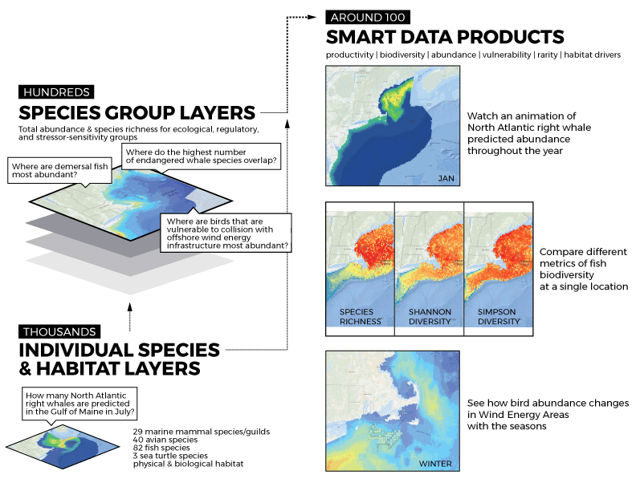

--- 
title: "Components of Ecological Importance for Northeast Ocean Planning"
author: "Emily Shumchenia, Jesse Cleary, Corrie Curtice"
date: "`r Sys.Date()`"
cover-image: "/images/IEA-data.png"
site: bookdown::bookdown_site
documentclass: book
bibliography: [book.bib]
biblio-style: "apalike"
link-citations: yes
github-repo: eshumchenia/northeast_cei
url: 'http\://github.com/eshumchenia/northeast_cei'
description: "Explainers for CEIs"
---

# Purpose

These documents are intended for [Northeast Ocean Data Portal](http://www.northeastoceandata.org) users. The purpose is to provide plain-language explanations of the marine life and habitat data products developed by the [Marine life Data & Analysis Team (MDAT)](http://seamap.env.duke.edu/models/mdat/) to support the framework for Components of Ecological Importance.

```{r iea-fig, echo=FALSE, fig.align='center'}



```

<!--chapter:end:index.Rmd-->


# {.tabset}

Placeholder


## required packages
## load data: these are rasters of species richness, shannon index, and simpson index for mdat cetacean models.
## clip all rasters to the same extent as richness
## convert rasters to data frames
## What are diversity metrics?
## Dig deeper {.tabset}
## plot the three maps
## species richness map and histogram
## simpson index map and histogram
## shannon index map and histogram
### Species Richness
### Simpson Index
### Shannon Index
#### Are the metrics similar or different? 
## make a raster stack for each species group's set of diversity metrics
## extract each stack's values to a table
## change the column headers
## calculate correlations among diversity metrics, plot as block correlation chart
#### How do the metrics' results compare to one another?  
#### Do the metrics represent ecological patterns similarly?  
## load bathymetry data and crop to the same extent as richness
## make the cet_metrics object into a dataframe, omitting NAs
## extract water depth values from bathy raster to a data object, omitting NAs and reversing sign
## combine all the data into a single data frame

<!--chapter:end:div.Rmd-->

