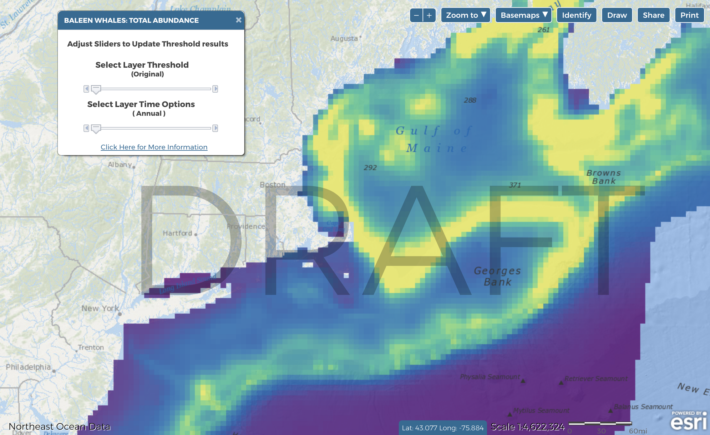

<link rel="stylesheet" href="https://use.fontawesome.com/releases/v5.0.13/css/all.css" integrity="sha384-DNOHZ68U8hZfKXOrtjWvjxusGo9WQnrNx2sqG0tfsghAvtVlRW3tvkXWZh58N9jp" crossorigin="anonymous">

<link href="site_libs/fontawesome-free-5.0.13/web-fonts-with-css/css/fontawesome.min.css" rel="stylesheet">

```{block, type='rmdcomment'}

<link href="site_libs/fontawesome-free-5.0.13/web-fonts-with-css/css/fontawesome.min.css" rel="stylesheet">

##**WHAT YOU NEED TO KNOW**  

**Abundance is dynamic, and the patterns in abundance maps can be driven by one 
or a few species. Species group and taxa abundance maps should always be used as 
a starting point for more in-depth analyses of individual species and higher 
temporal resolutions.**  

* Total abundance maps show where all individuals of a species group or whole 
taxon are distributed on average over a given time period.

* Species abundance patterns change throughout the year.  

* Because of differences in species sampling and mapping methods, we do not 
represent the same time windows for all species. Cetaceans are characterized 
monthly, birds are characterized seasonally, and fish are represented by their 
fall biomass only.  

* For seasonal and monthly species group abundance products, the composition of 
species groups may change due to data availability. Consult the data product 
documentation to understand what species are being represented in a map.  


```

***
### Why abundance?

Abundance is important for ocean planning because areas where many organisms are 
present are places where:  

1. Any interactions with human uses could affect high numbers of individuals;  

2. Organisms could be feeding/foraging, breeding/spawning, rearing young, resting, 
migrating, or any other function important to the life-history of the species;  

3. Biological productivity may be generally high and habitat may be complex  

### How is abundance mapped?
Total abundance maps are developed by simple addition. Abundance maps for each 
individual species in a group are stacked and added. Each pixel in the resulting 
map represents the sum of all individuals of all species present there during 
that time period.  

<div style="text-align: center; padding: 10px">
 

</div>  

### Why are there so many abundance layers?
Abundnance is dynamic. The species using an area change due to the patchy 
distribution of resources in the 3-dimensional ocean environment 
([Levin and Whitfield 1994](#references), [Carr et al. 2003](#references), 
[Lourie and Vincent 2004](#references), [Briscoe et al. 2016](#references)). 
Data products were developed for the smallest time windows possible (e.g.,
months, seasons) to capture this variability. Data products were also developed 
for groups of species with similar ecology, because they may be aggregating in 
locations for similar reasons.  

<div style="text-align: center; padding: 10px">
 

</div>

Compare maps of monthly baleen whale abundance (left, animated) with a map of total
annual baleen whale abundance averaged across all months (right).  

***

## DIG DEEPER

### Abundance is linked to other ecological factors
Static and dynamic features and processes like the shelf break, seamounts, sea 
surface temperature fronts, eddies, and upwelling areas are mappable and 
somewhat predictable. These geological and biophysical features and processes 
can generate locally high productivity and thus attract large numbers of 
organisms to certain places during certain times of year 
([Briscoe et al. 2016 and references therein](#references), [Santora et al. 
2017](#references), [Mannocci et al. 2017](#references)), including humans 
([Watson et al. 2018](#references), [Brigolin et al. 2018](#references)). See 
HABITAT AND OCEANGRAPHIC DRIVERS and PRODUCTIVITY.  

<div style="text-align: center; padding: 10px">
 

</div>

For example, compare the distribution patterns of red hake biomass (1970-2014) in fall (left) with 
patterns in sea surface temperature front probability (2002-2013) in fall (right).  
   
***  

### Abundance is represented a few different ways

#### Total (annual) abundance
MDAT summary products were generated with annual mean abundance layers for each 
species in a group. For annual total abundance, all of the seasonal or monthly 
models for each species are averaged first. These annual averages are then 
stacked and summed. Averaging in this way can make it difficult to perceive peaks 
in abundance at certain times of year.

#### Monthly and seasonal abundance
Based on feedback from experts and stakeholders, MDAT developed layers 
representing species group abundance for the finest time windows possible. These 
layers can be viewed as animations, to show how abundance patterns may change 
throughout the year.  

#### Number of benthic megafauanl groups with above average abundance
Besides cetaceans, birds, and fish, there is information about benthic 
megafaunal abundance from surveys conducted by the University of Massachusetts 
School of Marine Science and Technology (SMAST).  

Based on data from their scallop video survey from 2003-2012, they mapped areas 
with consistent above average abundance of benthic megafaunal groups (sea stars, 
scallops, hermit crabs, skates, red hake, moon snails, crabs, flatfishes).    

<div style="text-align: center; padding: 10px">


</div>  

The resulting map (left) summarizes abundance patterns over almost a whole 
decade, but maps showing abundance patterns changing year-to-year for individual 
species are also linked to on the [Northeast Ocean Data Portal biological habitat map](https://www.northeastoceandata.org/data-explorer/?habitat|biological) 
(also shown right).

***

### References
Brigolin D, Girardi P, Miller PI, Xu W, Nachite D, Zucchetta M, Pranovi F. 2018. 
Using remote sensing indicators to investigate the association of landings with 
fronts: Application to the Alboran Sea (western Mediterranean Sea). Fisheries 
Oceanography (early view). doi:10.1111/fog.12262.  

<i class="fas fa-unlock"></i> Briscoe DK, Maxwell SM, Kudela R, Crowder LB, 
Croll D. 2016. Are we missing important areas in pelagic marine conservation? 
Redefining conservation hotspots in the ocean. Endangered Species Research 29: 
229-237. doi:10.3354/esr00710.  

<i class="fas fa-unlock"></i> Carr M, Neigel J, Estes J, Andelman S, Warner R, 
Largier J. 2003. Comparing marine and terrestrial ecosystems: implications for 
the design of coastal marine reserves. Ecological Applications 13: 90−107. doi:10.1890/1051-0761(2003)013[0090:CMATEI]2.0.CO;2.  

Levin SA, Whitfield M. 1994. Patchiness in marine and terrestrial systems: from 
individuals to populations. Philosophical Transactions of the Royal Society B 
343: 99−103. doi:10.1098/rstb.1994.0013.  

Lourie S, Vincent A. 2004. Using biogeography to help set priorities in marine 
conservation. Conservation Biology 18: 1004−1020. doi:10.1111/j.1523-1739.2004.00137.x.  

<i class="fas fa-unlock"></i> Mannocci L, Boustany AM, Roberts JJ, Palacios DM, 
Dunn DC, Halpin PN, Viehman S, Moxley J, Cleary J, Bailey H, Bograd SJ, Becker EA, 
Gardner B, Hartog JR, Hazen EL, Ferguson MC, Forney KA, Kinlan BP, Oliver MJ, 
Perretti CT, Ridoux V, Teo SLH, Winship A. Temporal resolutions in species 
distribution models of highly mobile marine animals: Recommendations for 
ecologists and managers. Diversity and Distributions 23: 1098-1109. 
doi:10.1111/ddi.12609.  

Santora JA, Syderman WJ, Schroeder ID, Field JC, Miller RR, Wells BK. 2017. 
Persistence of trophic hotspots and relation to human impacts within an upwelling 
marine ecosystem. Ecological Applications 27(2): 560-574. doi:10.1002/eap.1466.  

<i class="fas fa-unlock"></i> Watson JR, Fuller EC, Castruccio FS, Samhouri JF. 
2018. Fishermen follow fine-scale physical ocean features for finance. Frontiers 
in Marine Science 5:46. doi:10.3389/fmars.2018.00046.  