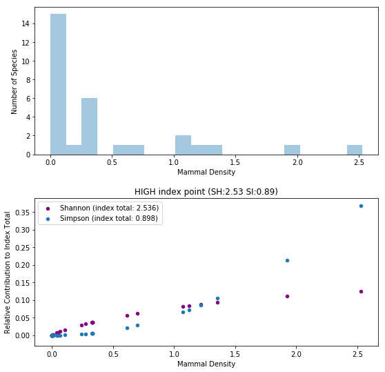

# {.tabset}

```{block, type='rmdcomment'}

**WHAT YOU NEED TO KNOW**  

**Different diversity metrics may respond to species' abundance patterns differently, and you may need to look at one or a combination of them to most accurately answer your specific questions in the context of the habitat type or ecological component that is most important to you.**  

FOR EXAMPLE:  

* If you are most concerned about accounting for and considering rare species, **SPECIES RICHNESS** does the best job, by representing every species equally, regardless of abundance. However, temporal trends in species richness will not capture any changes to community composition in changing environments. For this reason, a biodiversity metric may be more useful for monitoring.  

* If you care about rare species, but need to give some additional consideration to species that are particularly abundant, the **SHANNON INDEX** does a good job.  

* If abundant or dominant species are important for your analysis, the **SIMPSON INDEX** gives more weight to highly abundant species, to the detriment of the representation of the rarest species.  

```

***

```{r loaddata, include=FALSE}

## required packages
library(dplyr)
library(raster)
library(viridis)
library(Hmisc)
library(knitr)
library(ggplot2)
library(plotly)
library(GGally)
library(shiny)

## load data: these are rasters of species richness, shannon index, and simpson index for mdat cetacean models.

cet_richness <-raster("data/div/mammal_richness_Cetaceans.tif")
cet_simpson <-raster("data/div/mammal_simpson_Cetaceans.tif")
cet_shannon <-raster("data/div/mammal_shannon_Cetaceans.tif")

## clip all rasters to the same extent as richness
cet_richness <-crop(cet_richness, extent(-347000, 1500000, -1081000, 1400000))
cet_simpson <-crop(cet_simpson, extent(-347000, 1500000, -1081000, 1400000))
cet_shannon <-crop(cet_shannon, extent(-347000, 1500000, -1081000, 1400000))

## convert rasters to data frames
richness_pts <- rasterToPoints(cet_richness)
richness_df <-data.frame(richness_pts)
colnames(richness_df) <- c("lon", "lat", "richness")

simpson_pts <- rasterToPoints(cet_simpson)
simpson_df <- data.frame(simpson_pts)
colnames(simpson_df) <- c("lon", "lat", "simpson")

shannon_pts <- rasterToPoints(cet_shannon)
shannon_df <- data.frame(shannon_pts)
colnames(shannon_df) <- c("lon", "lat", "shannon")

h1 <- hist(cet_richness, breaks=12)
h2 <- hist(cet_simpson, breaks=13)
h3 <- hist(cet_shannon, breaks=18)

```


## What are diversity metrics?

When most people think about diversity, they think about the total number of species in an area. However, the total number of species is a metric called [Species Richness](https://en.wikipedia.org/wiki/Species_richness).  

[Diversity indices](https://en.wikipedia.org/wiki/Diversity_index) are more complex metrics that take the total number of species *and* their abundances into account (in different ways, depending on the index).  

Experts in the region have indicated that each metric is valuable for different reasons. The scientific literature underscores the need to consider multiple diversity indices, even though some may seem interchangeable @Morris2014. In general, diversity indices that reflect species dominance and identity are more effective than Species Richness for tracking change over time @Hillebrand2018. 

Because each metric integrates information differently, it is important to know how they are similar or different, and how the outputs could be used.  

MDAT has developed diversity data products using three different metrics: [Species Richness](https://en.wikipedia.org/wiki/Species_richness), the [Shannon index](https://en.wikipedia.org/wiki/Diversity_index#Shannon_index), and the [Simpson index](https://en.wikipedia.org/wiki/Diversity_index#Simpson_index). 


## Dig deeper {.tabset}

To know how and when each metric could be used, we asked the following questions:  

1. Are the metrics similar or different?
2. How do their  results compare to one another?
3. Do the metrics represent ecological patterns similarly?

Below are the maps and data for Species Richness, Shannon Diversity, and Simpson Diversity for all cetacean species that we will use to help answer these questions. Mouse over the plots to view detail.  

```{r maps, echo=FALSE}

## plot the three maps

m1 <- ggplot(data=richness_df, aes(y=lat, x=lon)) + geom_raster(aes(fill=richness)) +
  scale_fill_gradientn(colors = viridis(256)) + theme_void()

m2 <- ggplot(data=simpson_df, aes(y=lat, x=lon)) + geom_raster(aes(fill=simpson)) +
  scale_fill_gradientn(colors = viridis(256)) + theme_void()

m3 <- ggplot(data=shannon_df, aes(y=lat, x=lon)) + geom_raster(aes(fill=shannon)) +
  scale_fill_gradientn(colors = viridis(256)) + theme_void()


hdat1 <- data.frame(counts= h1$counts, breaks = h1$mids)
ph1 <- ggplot(hdat1, aes(x = breaks, y = counts, fill = breaks)) + 
  geom_bar(stat = "identity",alpha = 0.8) +
  xlab("richness")+ ylab("frequency") +
  scale_fill_gradientn(colors = viridis(12)) + theme_void() + theme(legend.position = "none")


hdat2 <- data.frame(counts= h2$counts, breaks = h2$mids)
ph2 <- ggplot(hdat2, aes(x = breaks, y = counts, fill = breaks)) + 
  geom_bar(stat = "identity",alpha = 0.8) +
  xlab("simpson")+ ylab("frequency") +
  scale_fill_gradientn(colors = viridis(13)) + theme_void() + theme(legend.position = "none")


hdat3 <- data.frame(counts= h3$counts, breaks = h3$mids)
ph3 <- ggplot(hdat3, aes(x = breaks, y = counts, fill = breaks)) + 
  geom_bar(stat = "identity",alpha = 0.8) +
  xlab("shannon")+ ylab("frequency") +
  scale_fill_gradientn(colors = viridis(18)) + theme_void() + theme(legend.position = "none")

## species richness map and histogram
map1 <-ggplotly(m1)
hist1 <-ggplotly(ph1)

## simpson index map and histogram
map2 <-ggplotly(m2)
hist2 <-ggplotly(ph2)

## shannon index map and histogram
map3 <-ggplotly(m3)
hist3 <-ggplotly(ph3)

richness <- subplot(map1, hist1)
simpson <- subplot(map2, hist2)
shannon <- subplot(map3, hist3)

```

```{r, echo = FALSE}
shinyAppDir(
  "data/div")
  options=list(
    width="100%", height=700
  )
```


### Species Richness
```{r richness-fig, echo = FALSE, fig.asp = 0.6}

subplot(map1, hist1)

```

### Simpson Index
```{r simpson-fig, echo = FALSE, fig.asp = 0.6}

subplot(map2, hist2)

```

### Shannon Index
```{r shannon-fig, echo = FALSE, fig.asp = 0.6}

subplot(map3, hist3)

```

***

#### Are the metrics similar or different?

**ANSWER:** From the maps and histograms we can tell that Shannon and Simpson are more similar to each other than either of them are to Species Richness. We can check this by doing a simple correlation between each pair of metrics (a value of 1.0 = a perfect positive correlation, a value of -1.0 = a perfect negative correlation):
```{r corr-fig, echo=FALSE, fig.cap='Correlations between each pair of diversity metrics'}

## make a raster stack for each species group's set of diversity metrics
cet_stack <- stack(cet_richness, cet_shannon, cet_simpson)

## extract each stack's values to a table
cet_metrics <-values(cet_stack)

## change the column headers
colnames(cet_metrics) <- c("richness", "shannon", "simpson")

## calculate correlations among diversity metrics, plot as block correlation chart
ggcorr(cet_metrics, nbreaks=NULL, label=TRUE, label_round=2, label_size=5, label_color='white')

```

This result is not surprising since both Shannon and Simpson indices consider abundance information, and Species Richness does not.

#### How do the metrics' results compare to one another?  

We know that results for Species Richness are quite different from both Shannon and Simpson results. To understand differences in the results of these two indices (how each deals differently with abundance information), we can plot the Shannon and Simpson results together. The plots below shows how multiple species abundance and richness information at each location has contributed to each diversity index value for a single pixel with relatively high diversity.  

The first graph shows the density (abundance per unit area) values for all mammal species present in this pixel, and the number of species present (richness) at these densities. Note that there are many species with very low (near zero) densities in this pixel.  

The second graph plots the contribution of each density/richness observation to the total diversity index value for both the Shannon index and the Simpson Index. Note that there is only 1 species present at the highest density value of ~2.5 (top graph), but this observation contributes proportionally much more to the final Simpson index value (~35% of its total; bottom graph) than to the final Shannon index value (~10% of its total; bottom graph). 

```{r compare-fig, echo=FALSE, out.width='80%', fig.align='center', fig.cap='Cetacean density and richness information for a single pixel with relatively high diversity across all metrics'}



```


**ANSWER:** These plots show that both the Shannon Index and Simpson Index consider low to medium density values comparably. However, species with high densities contribute much more, proportionally, to the Simpson index than to the Shannon Index.  

This result indicates that the Simpson index gives more weight to highly abundant or dominant species than the Shannon index. The Shannon index treats rare species and dominant species more equally.

#### Do the metrics represent ecological patterns similarly? {.tabset}

```{r regressions, include=FALSE}

## load bathymetry data and crop to the same extent as richness
bathy <-raster("data/div/ETOPO1_mdat.tif")
bathy <-crop(bathy, extent(-347000, 1803000, -1081000, 1519000))

## make the cet_metrics object into a dataframe, omitting NAs
cet_metrics_df <-data.frame(cet_metrics)
cet_metrics_df <-na.omit(cet_metrics_df)

## extract water depth values from bathy raster to a data object, omitting NAs and reversing sign
depths <-values(bathy)
depths <-data.frame(depths)
depths <-na.omit(depths)
depths <-depths*-1

## combine all the data into a single data frame
alldata <- data.frame(cet_metrics_df$richness, cet_metrics_df$shannon, cet_metrics_df$simpson, depths$depths)
colnames(alldata) <- c("richness", "shannon", "simpson", "depth")

```

We know that depth is an important habitat variable for cetaceans - certain groups of species spend more time in deeper water, while other species have more coastal distributions.  

If each diversity metric integrated information in a similar way, we would expect each metric to represent cetacean diversity similarly across different ocean habitats. In other words, each metric will respond in the same way to changes in depth.   

We can look at a few different ocean "habitats", defined by differences in depth only. The values of each diversity metric are calculated in each ocean habitat. Each bar below show the range of values for each diversity metric in each depth habitat. Mouse over the bars to see their values.   

```{r habitats_results, echo=FALSE, results='asis'}

alldata$depth_cat <- cut(alldata$depth, 5, labels = c("<1000m","1000-2000m", "2000-3000m", "3000-4000m", ">4000m"))

b1 <- ggplot(alldata, aes(depth_cat, richness)) + geom_boxplot(aes(fill = depth_cat)) +
  scale_fill_brewer() + coord_fixed(ratio=0.17) + theme(legend.position = "none", axis.title.y = element_blank(), axis.title.x = element_blank()) + ggtitle("Species Richness")

b2 <- ggplot(alldata, aes(depth_cat, shannon)) + geom_boxplot(aes(fill = depth_cat)) +
  scale_fill_brewer() + theme(legend.position = "none", axis.title.y = element_blank(), axis.title.x = element_blank()) + coord_fixed(ratio=1.6) + ggtitle("Shannon Diversity")

b3 <- ggplot(alldata, aes(depth_cat, simpson)) + geom_boxplot(aes(fill = depth_cat)) +
  scale_fill_brewer() + xlab("Depth 'habitats'") + theme(legend.position = "none", axis.title.y = element_blank()) + coord_fixed(ratio=4.3) + ggtitle("Simpson Diversity")

ggplotly(b1)

ggplotly(b2)

ggplotly(b3)

```
**ANSWER:** While the Shannon and Simpson Diversity values show a similar response to depth habitats (diversity generally increasing with depth), Species Richness is different, with Richness being highest in the 1000-2000m depth habitat and generally decreasing in deeper habitats. 
