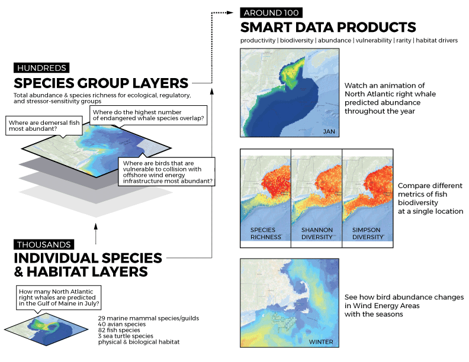

--- 
title: "Components of Ecological Importance for Northeast Ocean Planning"
output: html_document
---

These documents are intended for [Northeast Ocean Data Portal](http://www.northeastoceandata.org) users. The purpose is to provide plain-language explanations of the marine life and habitat data products developed by the [Marine life Data & Analysis Team (MDAT)](http://seamap.env.duke.edu/models/mdat/) to support the framework for Components of Ecological Importance.  

There are five components of ecological importance. Click on each component above to learn more.

```{r iea-fig, echo=FALSE, fig.align='center'}



```
