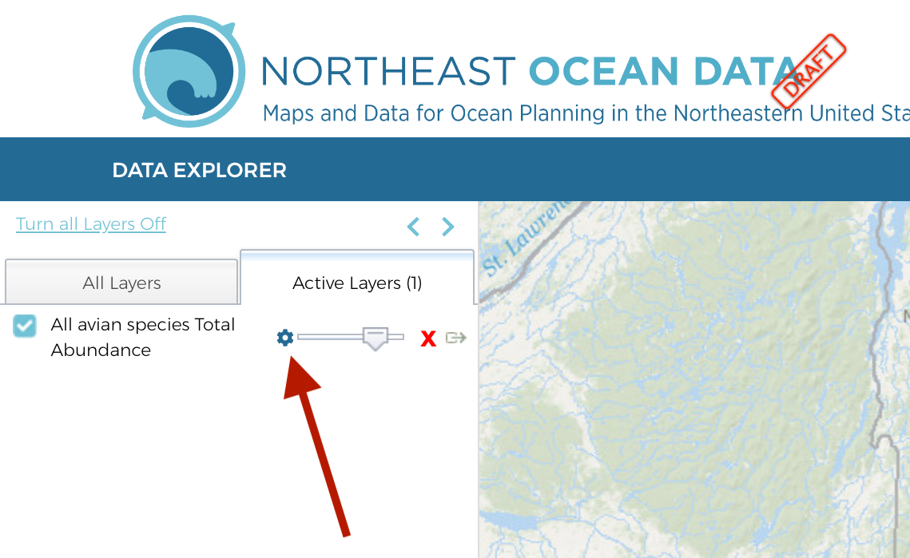
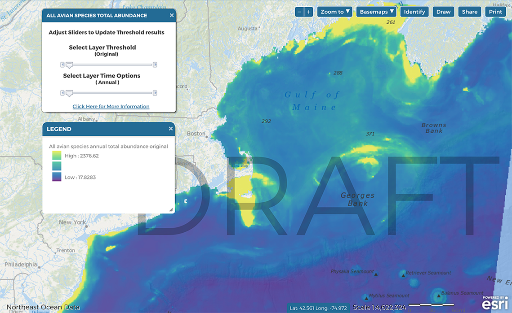
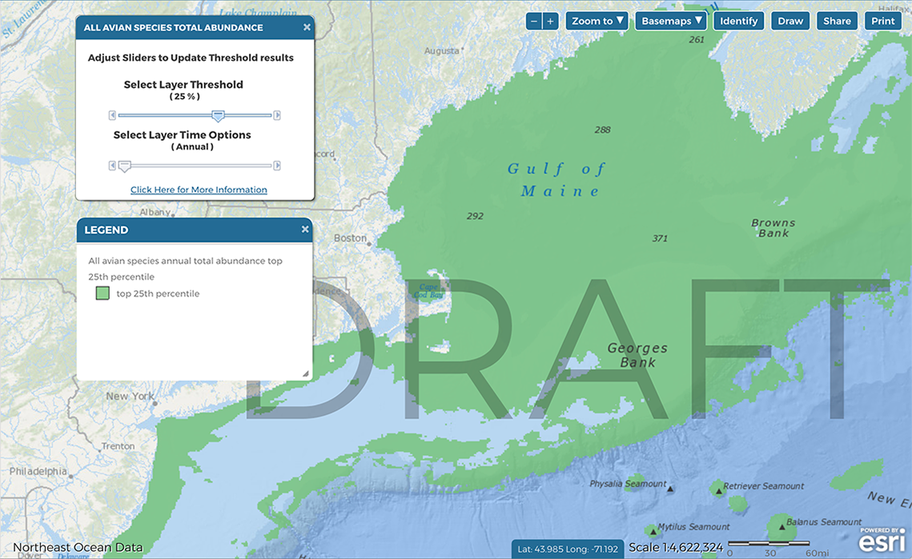
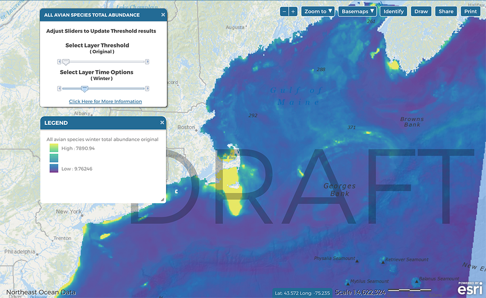
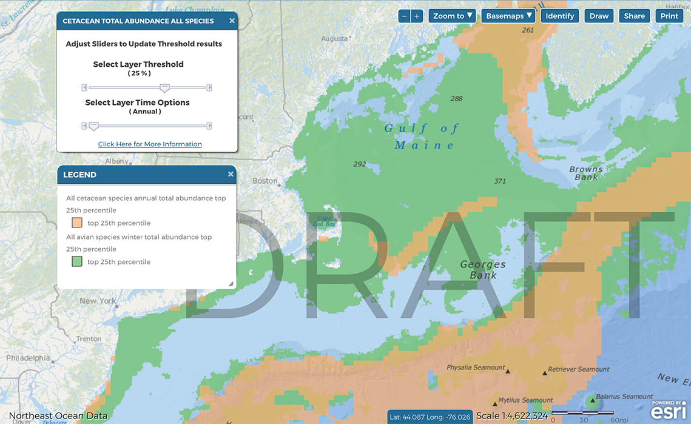
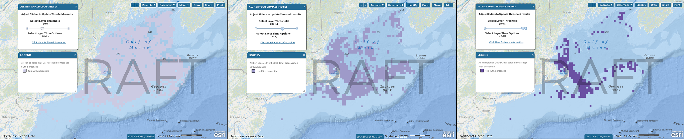

<link rel="stylesheet" href="https://use.fontawesome.com/releases/v5.0.13/css/all.css" integrity="sha384-DNOHZ68U8hZfKXOrtjWvjxusGo9WQnrNx2sqG0tfsghAvtVlRW3tvkXWZh58N9jp" crossorigin="anonymous">

<link href="site_libs/fontawesome-free-5.0.13/web-fonts-with-css/css/fontawesome.min.css" rel="stylesheet">

```{block, type='rmdcomment'}

<link href="site_libs/fontawesome-free-5.0.13/web-fonts-with-css/css/fontawesome.min.css" rel="stylesheet">

##**WHAT YOU NEED TO KNOW**  

**There are new tools available in the Data Explorer under Habitat and Oceanographic Drivers, Productivity, Biodiversity, Abundance, Vulnerability, and Rarity in the Data Explorer**

* Threshold products are new data layers that are calculated using a percentile method to represent the top 50%, 25%, and 10% of original data product. Threshold products allow users to visualize the subsets in addition to or separately from the original data, or any other dataset or threshold product.  

* Time options are available for layers with monthly or seasonal data.

```

## INSTRUCTIONS
|                                       |   |                                              |
|---------------------------------------|---|----------------------------------------------|
| | | If a data layer is compatible with the threshold tool or time options, a cog or gear icon <i class="fas fa-cog"></i> will be visible next to the layer in the Active Layers Tab. Click the gear icon to open the threshold and time options tools.
|  |   |-------------------------------------------------------------------------------------------------------|
| | | The default view displays the “original” data.
|  |   |-------------------------------------------------------------------------------------------------------|
| | | By advancing the top slider, three different threshold layers are toggled in sequence. **The 50% threshold represents the 50th percentile of the “original” data; The 25% threshold represents the 75th percentile of the “original” data; The 10% threshold represents the 90th percentile of the “original” data.** The threshold layers are specific to the particular time option that is selected (depending on data availability). 
|  |   |-------------------------------------------------------------------------------------------------------|
| | | By resetting the threshold slider to original, and advancing the bottom time slider, different seasons or months are toggled in sequence (depending on data availability).
|  |   |-------------------------------------------------------------------------------------------------------|
| | | Returning to the threshold slider, any of the three threshold layers can be viewed and toggled in sequence for the selected time option.
|  |   |-------------------------------------------------------------------------------------------------------|
| | | Multiple threshold layers can be overlaid on the same map. To add a threshold layer for another data product, click the gear icon for that data product in the Active Layers tab and select the desired threshold and time option. Use the transparency sliders in the Active Layers tab to adjust the visibility of each layer. Drag and drop the layers in the Active Layers tab to adjust the draw order. |

***

## DIG DEEPER

### What are threshold products and time options?
Threshold products are new data layers that represent a subset of an original 
data product. Threshold products allow users to visualize the subset in addition 
to or separately from the original data, or any other dataset or threshold 
product.    

Time options differ between marine life layers and habitat and oceanographic 
data layers (see more below).  

Threshold products were calculated for the annual averages (if available) and for 
each season (if available) or month (if available).

#### Marine life data time options    
Marine life individual species products have been developed at monthly resolution 
(cetaceans) and seasonal resolution (birds). Species group products were summarized 
to represent annual averages of these individual species products. Now, new 
marine life abundance products have been developed at monthly (for cetaceans) and 
seasonal (for birds) scales to show how species group abundance changes over time.  

#### Habitat and oceanographic data time options
Habitat and oceanographic data have previously been shown with seasonal 
resolution if the data existed (e.g., Median Chlorophyll-a Concentrations). Now, 
time option tools allow users to visualize these layers in sequence.  

***

### What methods were used to determine thresholds?
#### Statistical approach
A percentile approach was chosen due to its familiarity to broad audiences, 
for ease of communication, and based on knowledge of the statistical 
distribution patterns of the original datasets.  

After initial testing, three thresholds were chosen to provide multiple options 
for visualization. As a result, each original data product has three associated 
percentile-based threshold products.

Thresholds products were developed for the 50th percentile, 75th percentile, and 
90th percentile of each original data product. These products represent the top 
50%, 25%, and 10% of the original data, respectively.  

```{r, echo=FALSE, fig.cap="Examples of the three threshold products. From left to right, the top 50%, 25%, and 10% of All Fish Species (NEFSC) Fall Biomass"}
library(knitr)

```

<details>
<summary> **Additional information and considerations** </summary>

* **There are many other statistical approaches for calculating thresholds, including using custom/unique approaches depending on the dataset. In the current work, thresholds were applied uniformly to all datasets for demonstration purposes.**  

* **Ecological approaches to defining thresholds could also be considered.**  

* **Most of the original datasets are not normally-distributed, which can affect how different statistical thresholding methods represent the data.**  

</details>

#### Spatial extent
Thresholds were applied at the full spatial extent of each original data layer.

<details>
<summary> **Additional information and considerations** </summary>

**For some datasets, the range of values is expected to differ depending on 
spatial extent. For example, Habitat Complexity values are much higher around 
seamounts and canyons than coastal and shelf environments. Therefore, threshold 
products will always highlight canyon and seamount areas while areas of high
relative habitat complexity near the coast and on the shelf will be less 
obvious. One option to address this issue would be to segment the data into 
nearshore and offshore areas and calculate thresholds on those separate subsets.**    

**If the original data were clipped to a particular study area or region, the 
area highlighted by threshold products would be different. In this example, the 
resulting threshold products would only represent the top 10% of the original 
data *in that study area or region* and would not be comparable to thresholds 
calculated for the full extent of the data or for any other study area or 
region.**    

</details>

***

### Which data products have associated threshold products?
Thresholds were calculated only for data products in the Habitat and 
Oceanographic Drivers, Productivity, Biodiversity, Abundance, Vulnerability, and 
Rarity folders that represent components of ecological importance. In order to 
calculate thresholds, original data products needed to be continuous rasters. 
Threshold products were not generated for data products that represent areas or categories such as Canyons or Critical Habitat.  

Threshold products were developed for every available month or season associated 
with an original data layer.  

<details>
<summary> **Additional information and considerations** </summary>

**Threshold products were not calculated for the following products:**    

* *Species Richness* - from a statistical perspsective, these layers are more 
similar to categorical data. Initial tests of thresholds applied to these 
products generated confusing results.   

* *Simpson and Shannon Diversity Indices* - because the numerical value of these 
indices does not have absolute meaning, thresholds were not applied to these 
products. Initial tests of thresholds applied to these products generated 
results that were difficult to interpret.

**For some original data products with large numbers of zeroes, some of the threshold products include large numbers of zeroes. For the following datasets, the 50% threshold therefore displays as the full extent of the data: **  

* Anticyclonic eddy probability winter, spring summer  

**For the following datasets, the 50% threshold layer is shown without zeroes:** 

* Baleen whales July, August, September  

* Cetaceans sensitive to high-frequency sound, all months  

* Cetaceans sensitive to low-frequency sound July, August, September  

**For the following datasets, the 25% threshold layer is shown without zeroes:**  

* Cetaceans sensitive to high-frequency sound April, May, October, November  


